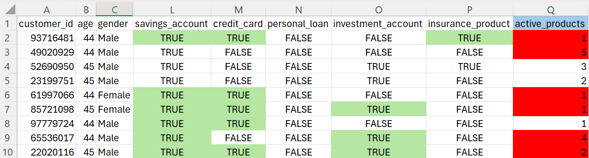
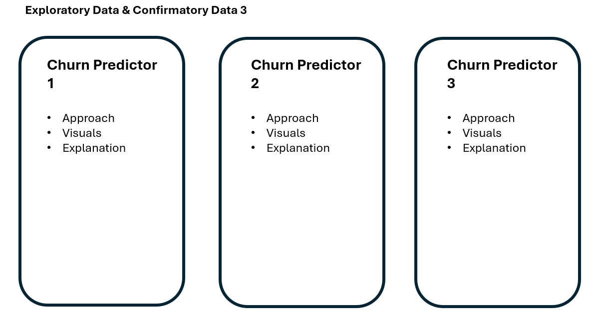
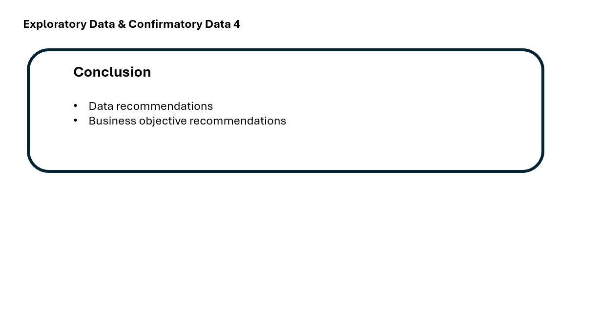

# Data Analysis of a Colombian Fintech Company

## Install and Load Packages

```{r}
pacman::p_load(ggrepel, patchwork, tidyverse, tidyverse, scales, viridis, lubridate, knitr, png, ggcorrplot, broom)
```

## Data Preparation

### 1. Load Data

```{r}
original <- read_csv("customer.csv")
```

### 2. Review Data

View data to understand the information persented.

```{r}
view(original)
```

i)  List variable names

```{r}
colnames(original)
```

ii) Missing Values Table

```{r}
missing_count <- colSums(is.na(original))

missing_table <- data.frame(
  Variable = names(missing_count)[missing_count > 0],
  MissingCount = missing_count[missing_count > 0]
)

print(missing_table)
```

### 3. Data Wrangling

a)  Calculate

The column 'active_products' does not tally with the five product offerings. A new value will be calculated.

```{r, echo=FALSE, warning=FALSE, message=FALSE}
library(knitr)

```

b)  Convert

The below columns will be converted to 'Date' format.

-   "first_tx"
-   "last_tx"
-   "last_survey_date"
-   "last_transaction_date"
-   "first_transaction_date"

c)  Duplicate

-   "average_transaction_value"
-   "total_transaction_volume"
-   "first_transaction_date"

d)  Replace

Values for 'feature_requests' and 'complaint_topics' will be converted to '1' if there is a response and '0' if there is none for more meaningful

```{r}
products <- c("savings_account", "credit_card", "personal_loan",
                  "investment_account", "insurance_product")

original <- original %>%
  mutate(active_products = rowSums(across(all_of(products))))

date_cols <- c("first_tx", "last_tx", "last_survey_date",
               "last_transaction_date", "first_transaction_date")

original <- original %>%
  mutate(across(all_of(date_cols), ~ as.Date(.x, format = "%Y-%m-%d")))

original <- original %>%
  select(-average_transaction_value,
         -total_transaction_volume,
         -first_transaction_date)

original <- original %>%
  mutate(
    has_complaint       = as.integer(!is.na(complaint_topics)),
    has_feature_request = as.integer(!is.na(feature_requests))
  )

write_csv(original, "customer_clean.csv")
```

## Exploratory Data Analysis

```{r}
customer_clean <- read_csv("customer_clean.csv")
```

### 1. Distribution of Churn Probability

```{r}
ggplot(customer_clean, aes(x = churn_probability)) +
  geom_histogram(binwidth = 0.01, fill = "#FFB3C6", colour = "white") +
  geom_vline(xintercept = mean(customer_clean$churn_probability),
             colour = "#FF007F", linetype = "dashed", linewidth = 0.8) +
  annotate("text", x = mean(customer_clean$churn_probability) + 0.015,
           y = 500, label = "Mean", colour = "#FF007F", size = 3.5) +
  labs(title = "Distribution of churn probability",
       x = "Churn probability", y = "Count") +
theme_classic()
```

A histogram is chosen to show the distribution of the churn probability

Key observations:

-   All customers have churn risk.
-   Most customers are moderate to high risk (skewed towards the right).
-   The churn probability is capped at 0.5 which is strange.

### 2. Correlation Matrix of Selected Variables

```{r, warning = FALSE}

variables <- c("age", "household_size", "active_products", "feature_usage_diversity",
          "failed_transactions", "tx_count", "base_satisfaction", "tx_satisfaction",
          "product_satisfaction", "satisfaction_score", "support_tickets_count",
          "resolved_tickets_ratio", "app_store_rating", "monthly_transaction_count",
          "customer_tenure", "churn_probability")

corrmatrix <- cor(customer_clean[, variables], use = "pairwise.complete.obs")

ggcorrplot(corrmatrix,
           method   = "square",
           type     = "lower",
           lab      = TRUE,
           lab_size = 2.5,
           tl.cex   = 9,
           colors   = c("#FF007F", "#B5D4F4", "#042C53"),
           title    = "Correlation Heatmap") +
  theme_classic() +
  theme(plot.title  = element_text(size = 14, face = "bold", hjust = 0.5),
        axis.text.x = element_text(angle = 45, hjust = 1, size = 8),
        axis.text.y = element_text(size = 8),
        axis.title  = element_blank(),
        plot.margin = margin(20, 20, 20, 20))
```

A correlation heatmap allows the relationships between the variables selected to be explored simultaneously.

Key observations:

-   The strongest positive correlation is between the number of products and features used.
-   There is strong correlation between age and churn probability.
-   The base satisfaction and satisfaction scores are highly correlated.

### 3. Churn Probability & Age, Gender, Income Bracket

```{r}
customer_clean %>%
  mutate(income_bracket = factor(income_bracket,
                                 levels = c("Low","Medium","High","Very High"))) %>%
  ggplot(aes(x = age, y = churn_probability, colour = gender)) +
  geom_smooth(method = "lm", se = FALSE) +
  facet_wrap(~ income_bracket) +
  labs(title = "Churn probability vs age, by gender and income bracket",
       x = "Age", y = "Churn probability", colour = "Gender")
```

A faceted line plot is used for this analysis as it allows for clear comparison across the variables selected. The age-churn relationship can be seen across income and gender groups.

Key observations:

-   Age is positively correlated with churn across every group.
-   This increases at higher income levels, especially for Gender = 'Other'
-   There is not much differentiation for Genders = 'Male' and 'Female' at lower income levels.

### 4. Satisfaction Exploratory Analysis

```{r}
p1 <- customer_clean %>%
  select(clv_segment, base_satisfaction, tx_satisfaction,
         product_satisfaction, churn_probability) %>%
  pivot_longer(cols = c(base_satisfaction, tx_satisfaction, product_satisfaction),
               names_to  = "satisfaction_type",
               values_to = "score") %>%
  mutate(
    satisfaction_type = recode(satisfaction_type,
      "base_satisfaction"    = "Base",
      "tx_satisfaction"      = "Transaction",
      "product_satisfaction" = "Product"),
    clv_segment = factor(clv_segment,
                         levels = c("Bronze", "Silver", "Gold", "Platinum"))
  ) %>%
  ggplot(aes(x = score, y = churn_probability, colour = clv_segment)) +
  geom_point(alpha = 0.05, size = 0.6) +
  geom_smooth(method = "lm", se = FALSE, linewidth = 1) +
  scale_colour_manual(values = c("#FFB3C6", "#FF007F", "#B5D4F4", "#042C53")) +
  facet_wrap(~ satisfaction_type, ncol = 3, scales = "free_x") +
  labs(title  = "Satisfaction vs Churn by CLV",
       x      = "Satisfaction score",
       y      = "Churn probability",
       colour = "CLV segment") +
  theme_classic() +
  theme(
    plot.title      = element_text(size = 11, face = "bold", hjust = 0.5),
    strip.text      = element_text(size = 8, face = "bold"),
    axis.text       = element_text(size = 7),
    axis.title.y    = element_text(size = 7, margin = margin(r = 5)),
    legend.position = "none"                                           
  )

p2 <- customer_clean %>%
  mutate(
    tenure_bucket = cut(customer_tenure,
                        breaks = c(0, 3, 6, 9, 12, Inf),
                        labels = c("0-3m", "3-6m", "6-9m", "9-12m", "12m+")),
    clv_segment = factor(clv_segment,
                         levels = c("Bronze", "Silver", "Gold", "Platinum"))
  ) %>%
  group_by(tenure_bucket, clv_segment) %>%
  summarise(avg_satisfaction = mean(satisfaction_score, na.rm = TRUE),
            .groups = "drop") %>%
  ggplot(aes(x = tenure_bucket, y = avg_satisfaction,
             colour = clv_segment, group = clv_segment)) +
  geom_line(linewidth = 1) +
  geom_point(size = 2.5) +
  scale_colour_manual(values = c("#FFB3C6", "#FF007F", "#B5D4F4", "#042C53")) +
  labs(title  = "Satisfaction over Tenure by CLV",
       x      = "Tenure",
       y      = "Avg satisfaction score",
       colour = "CLV segment") +
  theme_classic() +
  theme(
    plot.title      = element_text(size = 11, face = "bold", hjust = 0.5),
    axis.text       = element_text(size = 8),
    axis.title.y    = element_text(size = 7, margin = margin(r = 5)),
    legend.position = "bottom",
    legend.title    = element_text(size = 8),
    legend.text     = element_text(size = 7)
  )

p1 / p2 +
  plot_annotation(
    title = "Satisfaction Analysis",
    theme = theme(plot.title = element_text(size = 14, face = "bold",
                                            hjust = 0.5))
  )
```

A scatter plot shows the relationship between satisfaction scores and churn probability across the three types of satisfaction scores.

A line chart is used to show changes over tenure (time) to facilitate trend analysis.

CLV is introduced into both graphs for consistency and adds another dimension which can be used for further analyses.

Key observations:

-   Product satisfaction does not align with the other two satisfaction measures and appears to be categorical rating.
-   CLV categories appear to overlap completely based on the scatter plot.
-   Satisfaction for "Bronze" customers trends downwards over time compared to others.

## Confirmatory Data Analysis

```{r}
customer_clean <- read_csv("customer_clean.csv")
```

### 1. Pearson Correlation Tests

a)  Age vs Churn Probability

```{r}
cor.test(customer_clean$age,
         customer_clean$churn_probability,
         method = "pearson")
```

b)  Products vs Feature Usage

```{r}
cor.test(customer_clean$active_products,
         customer_clean$feature_usage_diversity,
         method = "pearson")
```

c)  Base Satisfaction vs Satisfaction Score

```{r}
cor.test(customer_clean$base_satisfaction,
         customer_clean$satisfaction_score,
         method = "pearson")
```

Multiple Linear Regression Model

```{r}
churn_model <- lm(churn_probability ~ age + base_satisfaction +
                    active_products,
                  data = customer_clean)
summary(churn_model)
```

```{r}
tidy(churn_model, conf.int = TRUE) %>%
  filter(term != "(Intercept)") %>%
  ggplot(aes(x = estimate, y = term, xmin = conf.low, xmax = conf.high)) +
  geom_pointrange(colour = "#FF007F") +
  geom_vline(xintercept = 0, linetype = "dashed", colour = "#042C53") +
  labs(title    = "Churn Probability Predictors",
       subtitle = paste("R² =", round(summary(churn_model)$r.squared, 3)),
       x        = "Coefficient estimate",
       y        = NULL) +
  theme_classic() +
  theme(plot.title    = element_text(size = 13, face = "bold", hjust = 0.5),
        plot.subtitle = element_text(size = 10, hjust = 0.5, colour = "#444441"))
```

Key observations: 

  * Age increases churn probability. 
  * Increases in product usage reduces churn probability. 
  * Higher satisfaction reduces churn probability.

Overall model score is low (0.073) so there are other factors which are more significant in explaining churn probability.

### 2. ANOVA Tests (Churn Probability)

a)  One-way ANOVA - Churn Probability & Income

```{r}
anova_income <- aov(churn_probability ~ income_bracket, data = customer_clean)
summary(anova_income)
```

b)  One-way ANOVA - Churn Probability & Gender

```{r}
anova_gender <- aov(churn_probability ~ gender, data = customer_clean)
summary(anova_gender)
```

c)  Two-way ANOVA - Churn Probability & Income, Gender

```{r}
anova_interaction <- aov(churn_probability ~ income_bracket * gender,
                         data = customer_clean)
summary(anova_interaction)
```

Key observations:

-   Gender is insignificant for churn prediction.
-   Income is statistically significant but a weak predictor.

### 3. ANOVA Tests (CLV)

a)  One-way ANOVA - CLV & Churn Probability

```{r}
anova_clv <- aov(churn_probability ~ clv_segment, data = customer_clean)

summary(anova_clv)
```

B)  One-way ANOVA - CLV & Satisfaction

```{r}
anova_sat <- aov(satisfaction_score ~ clv_segment, data = customer_clean)

summary(anova_sat)
```

Key observation:

- CLV predicts satisfaction but not churn.

## UI Story Board

Screen 1

The homepage tab will introduce the user churn probability modeling with the objective of customer retention.

The customer information & tenure is also shown on the same page, allowing the user to hover to view corresponding tenure.

```{r, echo=FALSE, warning=FALSE, message=FALSE}
library(knitr)
include_graphics("UI1.png")
```

Screen 2

Correlation matrix will be shown with selection of key variables on the right hand side. Hover for detailed rationale.

```{r, echo=FALSE, warning=FALSE, message=FALSE}
library(knitr)
include_graphics("UI2.png")
```

Screen 3

Churn predictors displayed can be moved around for side-by-side comparison.

```{r, echo=FALSE, warning=FALSE, message=FALSE}
library(knitr)

```

Screen 4

Conclusion with data and business recommendations

```{r, echo=FALSE, warning=FALSE, message=FALSE}
library(knitr)

```


