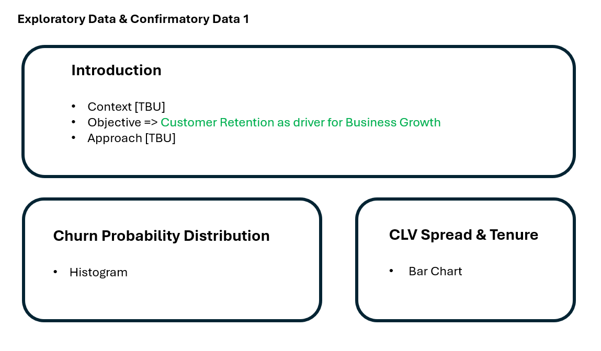
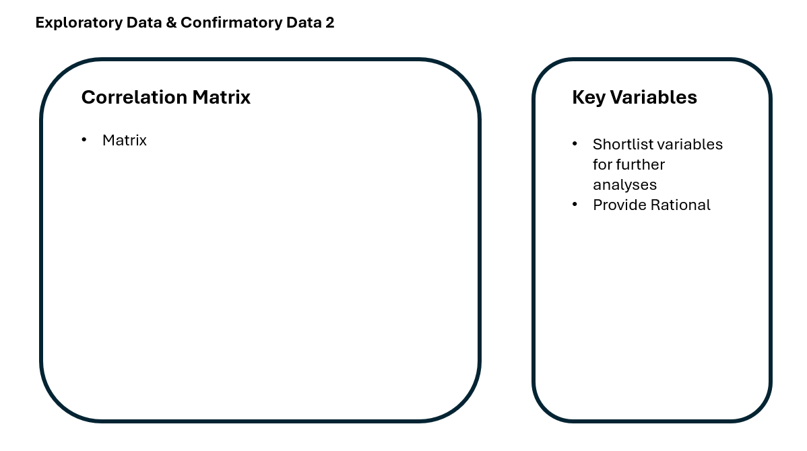

# Data Analysis of a Colombian Fintech Company (continued)

## Install and Load Packages

```{r}
pacman::p_load(ggrepel, patchwork, tidyverse, tidyverse, scales, viridis, lubridate, knitr, png, ggcorrplot, broom)
```

## Data Preparation

### 1. Load Data

```{r}
original <- read_csv("customer.csv")
```

### 2. Review Data

View data to understand the information persented.

```{r}
view(original)
```

i)  List variable names

```{r}
colnames(original)
```

ii) Missing Values Table

```{r}
missing_count <- colSums(is.na(original))

missing_table <- data.frame(
  Variable = names(missing_count)[missing_count > 0],
  MissingCount = missing_count[missing_count > 0]
)

print(missing_table)
```

### 3. Data Wrangling

a)  Calculate

The column 'active_products' does not tally with the five product offerings. A new value will be calculated.

b)  Convert

The below columns will be converted to 'Date' format.

-   "first_tx"
-   "last_tx"
-   "last_survey_date"
-   "last_transaction_date"
-   "first_transaction_date"

c)  Duplicate

-   "average_transaction_value"
-   "total_transaction_volume"
-   "first_transaction_date"

d)  Replace

Values for 'feature_requests' and 'complaint_topics' will be converted to '1' if there is a response and '0' if there is none for more meaningful

```{r}
products <- c("savings_account", "credit_card", "personal_loan",
                  "investment_account", "insurance_product")

original <- original %>%
  mutate(active_products = rowSums(across(all_of(products))))

date_cols <- c("first_tx", "last_tx", "last_survey_date",
               "last_transaction_date", "first_transaction_date")

original <- original %>%
  mutate(across(all_of(date_cols), ~ as.Date(.x, format = "%Y-%m-%d")))

original <- original %>%
  select(-average_transaction_value,
         -total_transaction_volume,
         -first_transaction_date)

original <- original %>%
  mutate(
    has_complaint       = as.integer(!is.na(complaint_topics)),
    has_feature_request = as.integer(!is.na(feature_requests))
  )

write_csv(original, "customer_clean.csv")
```

## Confirmatory Data Analysis

```{r}
customer_clean <- read_csv("customer_clean.csv")
```

### 1. Pearson Correlation Tests

a)  Age vs Churn Probability

```{r}
cor.test(customer_clean$age,
         customer_clean$churn_probability,
         method = "pearson")
```

b)  Products vs Feature Usage

```{r}
cor.test(customer_clean$active_products,
         customer_clean$feature_usage_diversity,
         method = "pearson")
```

c)  Base Satisfaction vs Satisfaction Score

```{r}
cor.test(customer_clean$base_satisfaction,
         customer_clean$satisfaction_score,
         method = "pearson")
```

Multiple Linear Regression Model

```{r}
churn_model <- lm(churn_probability ~ age + base_satisfaction +
                    active_products,
                  data = customer_clean)
summary(churn_model)
```

```{r}
tidy(churn_model, conf.int = TRUE) %>%
  filter(term != "(Intercept)") %>%
  ggplot(aes(x = estimate, y = term, xmin = conf.low, xmax = conf.high)) +
  geom_pointrange(colour = "#FF007F") +
  geom_vline(xintercept = 0, linetype = "dashed", colour = "#042C53") +
  labs(title    = "Churn Probability Predictors",
       subtitle = paste("R² =", round(summary(churn_model)$r.squared, 3)),
       x        = "Coefficient estimate",
       y        = NULL) +
  theme_classic() +
  theme(plot.title    = element_text(size = 13, face = "bold", hjust = 0.5),
        plot.subtitle = element_text(size = 10, hjust = 0.5, colour = "#444441"))
```

Key observation: \* Age increases churn probability. \* Increases in product usage reduces churn probability. \* Higher satisfaction reduces churn probability.

Overall model score is low (0.073) so there are other factors which are more significant in explaining churn probability.

### 2. ANOVA Tests (Churn Probability)

a)  One-way ANOVA - Churn Probability & Income

```{r}
anova_income <- aov(churn_probability ~ income_bracket, data = customer_clean)
summary(anova_income)
```

b)  One-way ANOVA - Churn Probability & Gender

```{r}
anova_gender <- aov(churn_probability ~ gender, data = customer_clean)
summary(anova_gender)
```

c)  Two-way ANOVA - Churn Probability & Income, Gender

```{r}
anova_interaction <- aov(churn_probability ~ income_bracket * gender,
                         data = customer_clean)
summary(anova_interaction)
```

Key observations:

-   Gender is insignificant for churn prediction.
-   Income is statistically significant but a weak predictor.

### 3. ANOVA Tests (CLV)

a)  One-way ANOVA - CLV & Churn Probability

```{r}
anova_clv <- aov(churn_probability ~ clv_segment, data = customer_clean)

summary(anova_clv)
```

B)  One-way ANOVA - CLV & Satisfaction

```{r}
anova_sat <- aov(satisfaction_score ~ clv_segment, data = customer_clean)

summary(anova_sat)
```

Key observation:

-   CLV predicts satisfaction but not churn.

## UI Story Board

Screen 1

The homepage tab will introduce the user churn probability modeling with the objective of customer retention.

The customer information & tenure is also shown on the same page, allowing the user to hover to view corresponding tenure.

```{r, echo=FALSE, warning=FALSE, message=FALSE}
library(knitr)

```

Screen 2

Correlation matrix will be shown with selection of key variables on the right hand side. Hover for detailed rationale.

```{r, echo=FALSE, warning=FALSE, message=FALSE}
library(knitr)

```

Screen 3

Churn predictors displayed can be moved around for side-by-side comparison.

```{r, echo=FALSE, warning=FALSE, message=FALSE}
library(knitr)
include_graphics("UI3.png")
```

Screen 4

Conclusion with data and business recommendations

```{r, echo=FALSE, warning=FALSE, message=FALSE}
library(knitr)
include_graphics("UI4.png")
```
